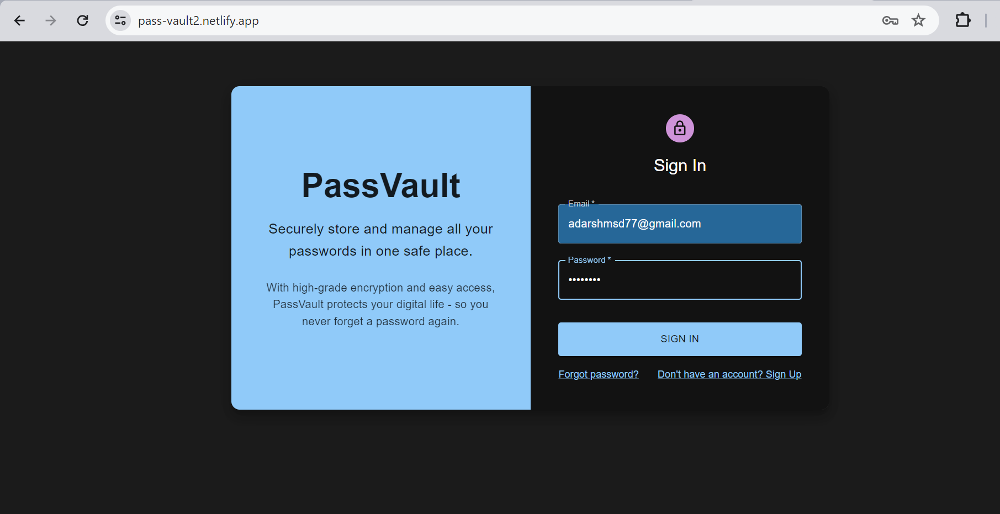

# 🔐 Pass Vault

A secure password vault. Store, encrypt, and manage your sensitive credentials with confidence.

---

## 🧰 Tech Stack

- 🔧 **Frontend**: React (Vite), Material UI
- 🐍 **Backend**: Python, FastAPI, Pydantic, Uvicorn
- 🔐 **Auth**: OTP Verification of Mail, JWT-based authentication
- 💾 **Storage**: Encrypted vaults stored in backend DB (PostgreSQL)
- 🌐 **CORS**, **dotenv**, and **deployment-ready**

---

## 📸 Preview

> A clean UI to manage your passwords — add, update, delete entries securely.

---

## 🚀 Features

- 🔐 User registration and login with hashed passwords
- 🔑 Master password protection for unlocking vaults
- 🧠 Secure client-side memory — tokens & session management
- 🧮 CRUD operations on credentials (name, URL, password, notes)
- ✉️ Toast notifications for user feedback
- 📦 LocalStorage to persist login state
- ⚙️ Environment-based configuration (dotenv)

---

LIVE LINK - https://pass-vault2.netlify.app/

